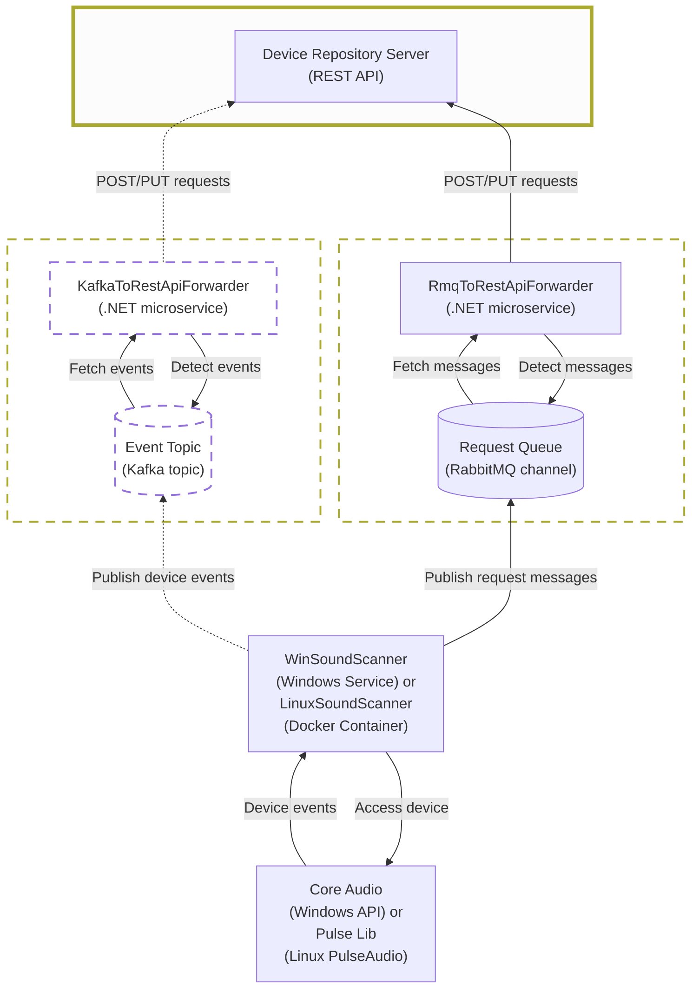

# audio-device-repo-server (Audio Device Repository Server, AudioDeviceRepoServer)

Audio Device Repository Server is a ASP.NET-Core-with REST-API-backend for storing and serving sound device data.

## Architecture



## Functions

- Exposes a REST API for audio device messages and queries.
- Persists and reads audio device data in MongoDB.
- Receives forwarded request messages from the RabbitMQ-to-REST forwarder.
- Serves the backend used by the React client.
- API details: [rest-api-documentation.md](DeviceRepoAspNetCore/rest-api-documentation.md)

## Technologies Used

- C# with .NET 8 (ASP.NET Core).
- MongoDB via `MongoDB.Driver`.
- Razor Pages and REST controllers.
- NUnit and Moq for automated tests.
- Postman collection for API checks.
- LibMan for client-side web assets.

## Software design pattern examples

- Repository: `Services\IAudioDeviceStorage` and `Services\MongoDbAudioDeviceStorage` 
  encapsulate MongoDB persistence behind an interface.

- DTO (data transfer object): `Models\RestApi\EntireDeviceMessage` and `Models\RestApi\VolumeChangeMessage`
  define API payloads separately from persistence models.

- Adapter/Mapper: `Models\MongoDb\AudioDeviceDocument.ToDeviceMessage()`
  converts MongoDB documents to REST DTOs.

## Build and Debug

### Prerequisites

- .NET SDK 8.0
- LibMan CLI installed

### Build

```powershell
git submodule update --init --recursive
dotnet tool install -g Microsoft.Web.LibraryManager.Cli
dotnet restore
dotnet build
```

### Run and Debug

#### Database and Environment Variables:

The MongoDB setting should to be overridden via environment variables, as the default `appsettings.json`
are specific to the developer defaults:
- `ConnectionStringAnonymous` (override it via `MongoDbSettings__ConnectionStringAnonymous`) is used to connect to MongoDB instance (not necessarily without credentials)
- `DatabaseName` (override it via `MongoDbSettings__DatabaseName`) is the name of the database to use in MongoDB.
- `MongoDbSettings__DatabaseUser` and `MongoDbSettings__DatabasePassword` environment variables
must be set to override MongoDB credentials from `appsettings.json`.
- `MaxConnectRetries` (override it via `MongoDbSettings__MaxConnectRetries`) defines how often MongoDB startup connection retries are attempted. The default in `appsettings.json` is `5`.

#### How to run:

```powershell
cd DeviceRepoAspNetCore
dotnet run --launch-profile http
```

- HTTP profile uses `http://localhost:5027`.
- Set breakpoints and start `DeviceRepoAspNetCore` in your IDE (Rider or Visual Studio).


### Tests

```powershell
dotnet test
```

Optional smoke host:

```powershell
dotnet run --project .\DeviceController.SmokeHost\DeviceController.SmokeHost.csproj --launch-profile http
```

### Run as Docker Container

Build from the repository root. The container serves HTTP on port `8080`.

```powershell
docker build -t audio-device-repo-server .
docker run --rm `
  --name audio-device-repo-server `
  -p 5027:8080 `
  -e MongoDbSettings__DatabaseUser="your-user" `
  -e MongoDbSettings__DatabasePassword="your-password" `
  audio-device-repo-server
```

You can test if the container is running and serving the API by displaying the server's Razor page:
http://localhost:5027/


## Changelog

- 2026-07-24 Logging noise reduction: middleware logs only /api-requets (not static file requests etc..
- 2026-04-10 Added `Dockerfile` for containerized server runs.
- 2026-04-09 Added environment variable usage for MongoDB settings.
- 2026-02-12 Updated `LICENSE` and `README` metadata.
- 2026-01-28 Updated launch settings to localhost URLs.
- 2026-01-23 Added controller tests against a real MongoDB backend.
- 2026-01-22 Moved MongoDB settings and storage to `DeviceControllerLib`.
- 2026-01-15 Extracted shared controller/models/interfaces to `DeviceControllerLib` and added `DeviceController.SmokeHost`.

## License

This project is licensed under the terms of the [MIT License](LICENSE).

## Contact

Eduard Danziger

Email: [edanziger@gmx.de](mailto:edanziger@gmx.de)
